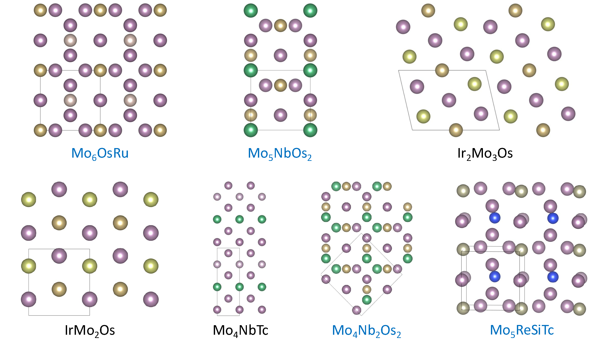

# Guided Diffusion for the Discovery of New Superconductors 

Implemetation guided diffusion using property embedding and classifier free guidance

[](https://huggingface.co/paprakash/GuidedMatDiffusion_model)
[](https://huggingface.co/datasets/paprakash/GuidedMatDiffusion_data)

[](https://www.python.org/downloads/)
[](https://pytorch.org/)
[](https://lightning.ai/docs/pytorch/stable/)

[](https://github.com/jiaor17/DiffCSP/blob/main/LICENSE) 

 [**[Original Paper]**](https://arxiv.org/abs/jhkjlkjj)

#### Workflow Pipeline


#### *De novo* generated new structural prototypes




### Setup

Clone this repo, cd into its directory, and run
```
pip install -e .
```
or 
```
pip install git+https://github.com/paprakash/GuidedMatDiffusion.git
```
The former is the preferred way, as one will still need scripts and configuration files which are present in this repo if installing directly.

torch-scatter and torch-sparse should also be installed. Their installation will depend on the version of PyTorch which is installed. 
For example, to install the binaries for PyTorch 2.3.0, simply run

```
pip install torch_scatter torch_sparse -f https://data.pyg.org/whl/torch-2.3.0+${CUDA}.html
```

where `${CUDA}` should be replaced by either `cpu`, `cu118`, or `cu121` depending on your PyTorch installation.

|             | `cpu` | `cu118` | `cu121` |
| ----------- | ----- | ------- | ------- |
| **Linux**   | ✅     | ✅       | ✅       |
| **Windows** | ✅     | ✅       | ✅       |
| **macOS**   | ✅     |         |         |

Rename the `.env.template` file into `.env` , specify the below variables and source it.

```
PROJECT_ROOT: the absolute path of this repo
HYDRA_JOBS: the absolute path to save hydra outputs
WABDB_DIR: the absolute path to save wabdb outputs
```

### Training


Fine-tuning a pre-trained foundation model for the Ab Initio Generation task

```
python diffcsp/run.py data=supccomb_12 model=diffusion_w_type expname=<expname> train.ckpt_path=<path_to_pretrained_checkpoint>
```

The ``<dataset>`` tag for fine_tuning for superconductivity is supcomb_12 but other dataset can be selected from perov_5, mp_20, mpts_52 and carbon_24, and the ``<expname>`` tag can be an arbitrary name to identify each experiment. Trained checkpoint to generates superconductors as well as a pre-trained foundation model used for fine-tunning is provided at [hugging_face](https://huggingface.co/paprakash/GuidedMatDiffusion_model/tree/main).

If one does not want to use WandB during training, comment out the "wandb" section in conf/logging/<your_config>.yaml. 


#### Ab initio generation

```
python scripts/generation.py --model_path <model_path> --dataset supccomb_12 --save_path <path_to_save_gen_structures> --band_gap <scaled/normalized_Tc> --guide_w <Guidace_weight> --batch_size <batch_size> --num_batch_to_sample <samples_in_each_batch>
```
To-do: changing the band_gap tag to property.

Note: To scale the property, here T_c value (Tc_actual) you want to give the model use - 
"""
scaler = torch.load(Path(scaler_path) / 'prop_scaler.pt')
Tc = scaler.transform(Tc_actual)
"""

### Pre-Training

Details of pre-training a foundation model, with alexandria dataset can be found in the pre_training branch.


### Acknowledgments

The main framework of this codebase is build upon [DiffCSP](https://github.com/jiaor17/DiffCSP.git).Fine-tuning superconductivity dataset is from combining [Cerqueira et al](https://archive.materialscloud.org/records/3kbt5-r3n56) and [Gibson et al](https://arxiv.org/pdf/2503.20005). For pre-training alexandria dataset is from [Alexandria](https://alexandria.icams.rub.de).


### Original Citation

```
@article{,

}
```

