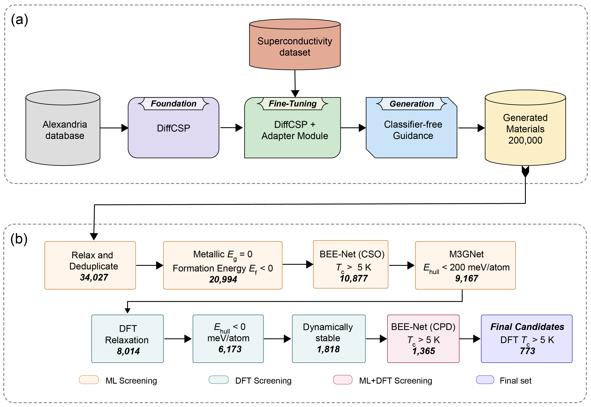

# Guided Diffusion for the Discovery of New Superconductors 

Implemetation guided diffusion using property embedding and classifier free guidance

[](https://github.com/jiaor17/DiffCSP/blob/main/LICENSE)   [**[Original Paper]**](https://arxiv.org/abs/2309.04475)




### Setup

Clone this repo, cd into its directory, and run
```
pip install -e .
```
or 
```
pip install git+https://github.com/FERMat-ML/MaterialsDiffusion.git
```
The former is the preferred way, as one will still need scripts and configuration files which are present in this repo if installing directly.

torch-scatter and torch-sparse should also be installed. Their installation will depend on the version of PyTorch which is installed. 
For example, to install the binaries for PyTorch 2.3.0, simply run

```
pip install torch_scatter torch_sparse -f https://data.pyg.org/whl/torch-2.3.0+${CUDA}.html
```

where `${CUDA}` should be replaced by either `cpu`, `cu118`, or `cu121` depending on your PyTorch installation.

|             | `cpu` | `cu118` | `cu121` |
| ----------- | ----- | ------- | ------- |
| **Linux**   | ✅     | ✅       | ✅       |
| **Windows** | ✅     | ✅       | ✅       |
| **macOS**   | ✅     |         |         |

Rename the `.env.template` file into `.env` , specify the below variables and source it.

```
PROJECT_ROOT: the absolute path of this repo
HYDRA_JOBS: the absolute path to save hydra outputs
WABDB_DIR: the absolute path to save wabdb outputs
```

### Training

For the CSP task

```
python diffcsp/run.py data=<dataset> expname=<expname>
```

For the Ab Initio Generation task

```
python diffcsp/run.py data=<dataset> model=diffusion_w_type expname=<expname>
```

The ``<dataset>`` tag can be selected from perov_5, mp_20, mpts_52 and carbon_24, and the ``<expname>`` tag can be an arbitrary name to identify each experiment. Pre-trained checkpoints are provided [here](https://drive.google.com/drive/folders/11WOc9lTZN4hkIY7SKLCIrbsTMGy9TsoW?usp=sharing).

If one does not want to use WandB during training, comment out the "wandb" section in conf/logging/default.yaml. 

### Evaluation

#### Stable structure prediction 

One sample 

```
python scripts/evaluate.py --model_path <model_path> --dataset <dataset>
python scripts/compute_metrics.py --root_path <model_path> --tasks csp --gt_file data/<dataset>/test.csv 
```

Multiple samples

```
python scripts/evaluate.py --model_path <model_path> --dataset <dataset> --num_evals 20
python scripts/compute_metrics.py --root_path <model_path> --tasks csp --gt_file data/<dataset>/test.csv --multi_eval
```

#### Ab initio generation

```
python scripts/generation.py --model_path <model_path> --dataset <dataset>
python scripts/compute_metrics.py --root_path <model_path> --tasks gen --gt_file data/<dataset>/test.csv
```


#### Sample from arbitrary composition

```
python scripts/sample.py --model_path <model_path> --save_path <save_path> --formula <formula> --num_evals <num_evals>
```

#### Property Optimization

```
# train a time-dependent energy prediction model 
python diffcsp/run.py data=<dataset> model=energy expname=<expname> data.datamodule.batch_size.test=100

# Optimization
python scripts/optimization.py --model_path <energy_model_path> --uncond_path <model_path>

# Evaluation
python scripts/compute_metrics.py --root_path <energy_model_path> --tasks opt
```

### Acknowledgments

The main framework of this codebase is build upon [CDVAE](https://github.com/txie-93/cdvae). For the datasets, Perov-5, Carbon-24 and MP-20 are from [CDVAE](https://github.com/txie-93/cdvae), and MPTS-52 is collected from its original [codebase](https://github.com/sparks-baird/mp-time-split).

### Original Citation

```
@article{jiao2023crystal,
  title={Crystal structure prediction by joint equivariant diffusion},
  author={Jiao, Rui and Huang, Wenbing and Lin, Peijia and Han, Jiaqi and Chen, Pin and Lu, Yutong and Liu, Yang},
  journal={arXiv preprint arXiv:2309.04475},
  year={2023}
}
```

